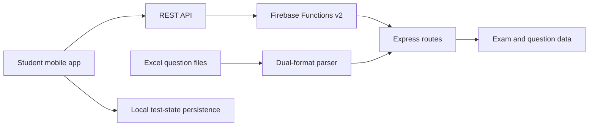

# AssessYourself

> Portfolio case study raw draft. Written for a non-technical founder evaluating whether to hire us.

## 1. One-line description

**AssessYourself is an exam-discovery and government-exam preparation app for students preparing for exams such as UPSC, SSC, MPSC, and PSU exams.** [EVIDENCE: user-provided previous portfolio case study]

The product combines exam discovery, exam-detail information, practice tests, previous-year papers/live tests, and a backend workflow for bringing large question banks into the product. [EVIDENCE: user-provided previous portfolio case study]

## 2. Platforms and live status

- **Student product:** Flutter mobile app (Dart). [EVIDENCE: `subscription.dart` and Flutter debug logs from the supplied assessment/subscription case study]
- **Backend:** REST API layer built with Firebase Cloud Functions v2 and Express. [EVIDENCE: user-provided previous portfolio case study; supplied assessment/subscription case study]
- **Status:** The previous portfolio case study states **“Launching on Play Store.”** [EVIDENCE: user-provided previous portfolio case study]
- **Monetization flow:** Subscription/trial functionality was implemented on the student app, including a 15-day free trial, plan selection, active-trial locking, and payment-order creation through Razorpay. [EVIDENCE: supplied assessment/subscription case study]
- **Play Store URL:** **[NEEDS FOUNDER]** — no verified current listing was found from the supplied project material or current web search.
- **Portfolio/project URLs available in the supplied material:**
  - Hero image: `https://aditya-portfolio-delta-three.vercel.app/projects/ay_hero.webp` [EVIDENCE: user-provided previous portfolio case study]
  - About/product image: `https://aditya-portfolio-delta-three.vercel.app/projects/access_about.webp` [EVIDENCE: user-provided previous portfolio case study]

## 3. Exact stack

- **App:** Flutter (Dart) — not native Swift, not native Kotlin, not web. [EVIDENCE: `subscription.dart` and Flutter debug logs from the supplied assessment/subscription case study]
- **Backend:** Node.js + Express REST API running through Firebase Cloud Functions v2. [EVIDENCE: supplied assessment/subscription case study; user-provided previous portfolio case study]
- **Database:** Firestore. [EVIDENCE: supplied assessment/subscription case study]
- **Payments:** Razorpay, including order creation through `/api/payments/order`. [EVIDENCE: supplied assessment/subscription case study]
- **Local test-state persistence:** Android `SharedPreferences` used to persist the active test state. [EVIDENCE: user-provided previous portfolio case study]
- **API scope:** 15 REST APIs. [EVIDENCE: user-provided previous portfolio case study]
- **Repositories:** The supplied assessment/subscription case study describes separate app and backend repositories, with the backend owned on the client side. [EVIDENCE: supplied assessment/subscription case study]

## 4. Why this domain was hard

Government-exam preparation is not just a content catalogue. A usable product has to connect **structured exam information, eligibility/syllabus context, large question banks, timed test-taking, answer review, test history, and content administration** into one reliable flow. [EVIDENCE: user-provided previous portfolio case study]

The content itself was also operationally difficult. Questions arrived in Excel files with inconsistent column structures, Marathi numerals, mixed data types, and both text- and image-based options. [EVIDENCE: user-provided previous portfolio case study]

The testing experience adds a second class of difficulty: a student may be part-way through a long, timed paper when an Android device crashes, the operating system kills the app, or the user accidentally closes it. The supplied case study states that some papers had **60+ questions with strict time limits**, making loss of progress unacceptable. [EVIDENCE: user-provided previous portfolio case study]

There was also a separate access-control problem: premium access and trial eligibility span the mobile app, backend state, database records, and payment provider. The supplied assessment/subscription case study shows that trial eligibility was moved away from client-side calculation so the backend could remain authoritative. [EVIDENCE: supplied assessment/subscription case study]

## 5. Before / after for the end user

### Before

A student preparing for Indian government exams had to find information across multiple sources rather than using one place to browse exams, check eligibility, view syllabi, and practice. [EVIDENCE: user-provided previous portfolio case study]

The supplied case study also indicates that the content team had a large bank of questions in spreadsheets that could not simply be dropped into the app without cleaning and transformation. [EVIDENCE: user-provided previous portfolio case study]

### After

AssessYourself brings exam discovery and preparation into one student-facing product, including exam details, practice tests, previous-year papers, live tests, timed question answering, review marking, submission, instant analysis, and score history. [EVIDENCE: user-provided previous portfolio case study]

The question-bank workflow turns an Excel upload into structured content with row-level error reporting instead of requiring every question to be entered manually. [EVIDENCE: user-provided previous portfolio case study]

An interrupted test can also be restored from saved state, allowing the student to continue from the last stored answers, review flags, and elapsed-time state. [EVIDENCE: user-provided previous portfolio case study]

For the monetized experience, a new user could start a **15-day free trial** from the subscription screen; an active trial showed the selected plan as locked and the trial action as disabled, reducing the chance of duplicate or conflicting trial actions. [EVIDENCE: supplied assessment/subscription case study]

### Business/user outcomes we should not claim without confirmation

- **[NEEDS FOUNDER]** Number of students using the product.
- **[NEEDS FOUNDER]** Number of exams/questions loaded into production.
- **[NEEDS FOUNDER]** Launch date and current store availability.
- **[NEEDS FOUNDER]** Any improvement in completion, retention, test attempts, or content-operations time.
- **[NEEDS FOUNDER]** Any commercial or revenue outcome.

## 6. Scope delivered vs time and team

### Delivered

- Student core feature / student testing experience. [EVIDENCE: user-provided previous portfolio case study]
- Exam detail pages. [EVIDENCE: user-provided previous portfolio case study]
- Previous-year paper flow. [EVIDENCE: user-provided previous portfolio case study]
- Live-test flow with scheduled start/end times. [EVIDENCE: user-provided previous portfolio case study]
- Full test-taking engine: start test, answer questions, mark for review, track time, submit, and view analysis/history. [EVIDENCE: user-provided previous portfolio case study]
- Dual-format Excel parser for bulk question upload. [EVIDENCE: user-provided previous portfolio case study]
- Row-level parsing/error reporting. [EVIDENCE: user-provided previous portfolio case study]
- Support for text and image-based options in imported questions. [EVIDENCE: user-provided previous portfolio case study]
- 15 REST APIs for backend/admin control. [EVIDENCE: user-provided previous portfolio case study]

### Timeline

- **3–4 weeks.** [EVIDENCE: user-provided previous portfolio case study]

### Team

- The supplied case study describes the work in first person but does **not** state the full project team composition. **[NEEDS FOUNDER]** Confirm whether this was a solo build, a small team, or a mixed client/developer team before publishing.

### Lines of code

- Deliberately omitted. **[INFERRED]** Code volume is not a useful indicator for a founder evaluating product-development capability.

## 7. Key technical decisions

### Treat Excel as an ingestion problem, not a one-off import

A rigid parser was not appropriate because the source spreadsheets could vary in structure and data types. The implementation instead detected supported structures and accumulated invalid rows into an error report rather than stopping the full upload at the first bad row. [EVIDENCE: user-provided previous portfolio case study]

**Why it mattered:** the content workflow could continue even when individual questions needed correction. [INFERRED]

### Handle multipart uploads below Firebase's automatic request parsing

Firebase Functions v2 was found to intercept the multipart/form-data stream before Express could reliably read the Excel upload. The implementation therefore bypassed the native parser, passed the raw stream through to Express, and disabled Firebase-level body parsing/CORS for the relevant function path. [EVIDENCE: user-provided previous portfolio case study]

**Why it mattered:** the upload path could accept the actual file stream instead of failing silently. [INFERRED]

### Keep premium entitlement state server-authoritative

The app was changed so trial/subscription eligibility came from backend state rather than being calculated locally. The supplied assessment/subscription case study specifically documents removal of a client-side `checkTrialEligibility()` path. [EVIDENCE: supplied assessment/subscription case study]

**Why it mattered:** eligibility is a product rule, so keeping it server-authoritative reduces the risk of conflicting states between devices and the backend. [INFERRED]

### Keep deep exam content addressable by IDs

The test data model used ID references between content layers rather than repeatedly embedding entire child objects. Queries could then retrieve only the layer needed for a given request, with backend filtering applied to the result. [EVIDENCE: user-provided previous portfolio case study]

**Why it mattered:** it reduced unnecessary data traversal and was intended to keep test retrieval responsive as content depth increased. [INFERRED]

### Lock the active trial state instead of allowing plan-hopping

The supplied assessment/subscription case study describes an active-trial state where the user's chosen plan stays selected and locked, while the trial action becomes disabled. [EVIDENCE: `GetPremiumPage` implementation described in supplied assessment/subscription case study]

**Why it mattered:** the UI reflects the backend entitlement state instead of presenting actions that could conflict with an already-active trial. [INFERRED]

### Persist the entire active test state locally

For interrupted exams, the implementation saved selected answers, review flags, and elapsed time after every interaction using `SharedPreferences`. On relaunch, an incomplete test could be detected and restored. [EVIDENCE: user-provided previous portfolio case study]

**Why it mattered:** students did not have to restart a long timed paper solely because the app process was interrupted. [INFERRED]

## 8. Dead ends and deliberate “not built” choices

### Client-side trial eligibility was removed

A client-side `checkTrialEligibility()` path was removed once the backend became the source of truth for trial/subscription state. [EVIDENCE: supplied assessment/subscription case study]

### Trial UI was simplified around user state

An earlier premium-screen approach handled more states than necessary; the final direction used a single primary action whose label and enabled/disabled state communicated the user's current entitlement. [EVIDENCE: supplied assessment/subscription case study]

### Recurring auto-pay was deliberately left unresolved

The supplied assessment/subscription case study records an explicit decision not to prematurely build Razorpay recurring subscriptions while the renewal model was still undecided. [EVIDENCE: supplied assessment/subscription case study]

### Firebase's default multipart parsing was not suitable for the upload path

The initial approach relied on Firebase's normal request handling, but the multipart stream was intercepted/corrupted before Express could consume it. The final implementation deliberately bypassed that parser for the relevant upload path. [EVIDENCE: user-provided previous portfolio case study]

### A rigid, single-format Excel parser was ruled out

Because the source files contained inconsistent column structures, Marathi numerals, and mixed data types, a strict parser would have failed on the first inconsistency. The implementation instead used a dual-format parser with row-level error accumulation. [EVIDENCE: user-provided previous portfolio case study]

### No broad feature expansion is documented

The supplied material focuses on the student testing core, exam information, question ingestion, and backend control. It does not document a broader social layer, payments, chat/community features, or other adjacent capabilities. **[INFERRED]** These should not be presented as features that were intentionally rejected unless the founder confirms the decision.

## 9. Before / after numbers from commits and code

The currently available source material does not include the repository, commit history, or measurable runtime logs, so no code-derived performance or failure metrics can be claimed yet. **[EVIDENCE: user-provided previous portfolio case study]**

### Numbers explicitly stated in the supplied case study

- **15 REST APIs.** [EVIDENCE: user-provided previous portfolio case study]
- **3–4 week timeline.** [EVIDENCE: user-provided previous portfolio case study]
- **60+ questions** referenced for the long timed-paper recovery problem. [EVIDENCE: user-provided previous portfolio case study]
- **2 supported Excel formats** described by the “dual-format parser” wording. [EVIDENCE: user-provided previous portfolio case study]

- **15-day free trial** in the subscription flow. [EVIDENCE: supplied assessment/subscription case study]

### Numbers not currently available

- Upload failure rate before/after. **[NEEDS FOUNDER]**
- Upload duration before/after. **[NEEDS FOUNDER]**
- Test restoration success rate. **[NEEDS FOUNDER]**
- API latency before/after. **[NEEDS FOUNDER]**
- Content import time saved per exam. **[NEEDS FOUNDER]**
- Student usage / retention / completion metrics. **[NEEDS FOUNDER]**

## 10. Hard problems solved

### Reliable bulk question ingestion

The content pipeline had to accept messy real-world spreadsheets rather than idealized CSV-style data. The dual-format parser, mixed-type handling, image/text options, and row-level error reporting addressed this operational problem. [EVIDENCE: user-provided previous portfolio case study]

### Multipart upload reliability on Firebase

The upload path required working around Firebase Functions v2 request parsing so the raw file stream could reach Express correctly. [EVIDENCE: user-provided previous portfolio case study]

### Deeply nested exam content without wasteful traversal

The test retrieval model used ID references and targeted queries instead of repeatedly traversing full nested structures. [EVIDENCE: user-provided previous portfolio case study]

### Exam continuity on unreliable mobile conditions

The app persisted the active test state frequently enough to recover answers, review flags, and elapsed time after app interruption. [EVIDENCE: user-provided previous portfolio case study]

### Subscription state inconsistencies and legacy records

The subscription implementation had to handle cases where an existing trial user could have a special `trial_plan` ID that did not map cleanly to a normal Firestore plan document, as well as older trial records without a stored plan reference. The final UI treated backend trial state as authoritative and degraded gracefully rather than allowing a missing plan record to break the active-trial screen. [EVIDENCE: supplied assessment/subscription case study]

## 11. Screenshots and diagrams

Capture **3–6 screens** that tell the product story from the student's perspective, prioritizing these views:

1. **Exam detail page** — show the decision-making context before starting a paper. **[INFERRED]** Existing portfolio material references exam detail pages, but the exact route/file is not known. **[NEEDS FOUNDER]**
2. **Test-taking screen** — show question answering, timer, and mark-for-review state. **[INFERRED]** Exact screen route/file is not known. **[NEEDS FOUNDER]**
3. **Test analysis/result screen** — show the result/analysis and score-history concept. **[INFERRED]** Exact screen route/file is not known. **[NEEDS FOUNDER]**
4. **Exam discovery/listing screen** — show how students browse available exams. **[INFERRED]** Exact screen route/file is not known. **[NEEDS FOUNDER]**
5. **Question-upload/admin screen** — show the operational side only when useful for a founder audience. **[INFERRED]** Existing case-study copy confirms an Excel upload workflow, but the exact screen route/file is not known. **[NEEDS FOUNDER]**

### Existing visual assets available from the old portfolio

- `/projects/ay_hero.webp` — hero image. [EVIDENCE: user-provided previous portfolio case study]
- `/projects/access_about.webp` — product/about image. [EVIDENCE: user-provided previous portfolio case study]
- `/projects/a3.webp` — challenge mockup associated with reliable bulk question uploads. [EVIDENCE: user-provided previous portfolio case study]
- `/projects/a5.webp` — challenge mockup associated with the Excel parser/content workflow. [EVIDENCE: user-provided previous portfolio case study]
- `/projects/a6.webp` — challenge mockup associated with optimized data fetching. [EVIDENCE: user-provided previous portfolio case study]

### Branding / personal-data safety

Any screenshot that contains **[CLIENT] branding, real student names, email addresses, profile details, or live question-bank data should be redacted before publication.** **[INFERRED]** The supplied material does not confirm whether the existing mockups contain real data.

### Architecture diagram to draw

**Diagram note:** the high-level relationship between mobile client, REST APIs, Firebase Functions/Express, Excel ingestion, and local test persistence is supported by the case-study material; the exact database/storage component is not identified and is therefore intentionally generic. **[INFERRED]**

## 12. Reusable lessons

- **Design the ingestion workflow around the data people actually provide, not the cleanest schema you wish they had.** [INFERRED from evidence in: user-provided previous portfolio case study]
- **For timed mobile workflows, persistence is a core product feature, not just a technical safeguard.** [INFERRED from evidence in: user-provided previous portfolio case study]
- **When a managed platform interferes with a critical data path, isolate and control the affected boundary rather than rewriting the whole backend.** [INFERRED from evidence in: user-provided previous portfolio case study]
- **For hierarchical content, model the read path around the screen/query that needs the data instead of fetching the whole tree.** [INFERRED from evidence in: user-provided previous portfolio case study]

## 13. Positioning suggestion

This project can support positioning toward future clients building **content-heavy mobile products with structured workflows**, particularly education, training, certification, assessment, or other products that combine large datasets with a time-sensitive user journey. [INFERRED]

The strongest portfolio angle is the ability to take **messy operational data, complex entitlement rules, and a high-stakes timed workflow and turn them into a reliable product experience**, rather than presenting the work simply as “an exam app.” [INFERRED]

## 14. Technical appendix

### Backend architecture

The backend used Node.js + Express REST routes deployed through Firebase Cloud Functions v2, with Firestore used for plan/subscription data. [EVIDENCE: supplied assessment/subscription case study]

### Multipart upload handling

Firebase Functions v2 was interfering with `multipart/form-data` requests before the Express layer could consume the upload stream. The implementation bypassed Firebase's native parser for this path, passed raw request streams into Express, and disabled Firebase-level body parsing/CORS settings for the affected function configuration. [EVIDENCE: user-provided previous portfolio case study]

### Excel parsing

The parser was designed for at least two supported input structures and could handle mixed data types, Marathi numerals, and text/image options. Invalid rows were accumulated into a detailed error report instead of aborting the entire upload. [EVIDENCE: user-provided previous portfolio case study]

### Content retrieval model

The exam/content hierarchy used ID references between layers. Queries retrieved only the layer needed, with backend filtering applied to reduce unnecessary data traversal. [EVIDENCE: user-provided previous portfolio case study]

### Test-state persistence

The active test state included selected answers, mark-for-review flags, and elapsed time. The state was auto-saved after every interaction through `SharedPreferences`; on relaunch, the app could identify an incomplete test and restore the stored state. [EVIDENCE: user-provided previous portfolio case study]

### Subscription and entitlement handling

The Flutter app consumed backend subscription/trial state, rendered plan selection, started a 15-day free trial, locked the active trial plan, surfaced backend errors, and used Razorpay order creation for payment flow. [EVIDENCE: supplied assessment/subscription case study]

A special backend-side `trial_plan` state and legacy trial records required graceful handling when they could not resolve to a standard Firestore plan document. [EVIDENCE: supplied assessment/subscription case study]

### API scope

The prior case study reports **15 REST APIs** covering backend control for courses, subjects, topics, tests, questions, users, and analytics. [EVIDENCE: user-provided previous portfolio case study]

### Explicitly absent technical evidence

No repository tree, commit history, database schema, automated-test coverage, CI/CD configuration, monitoring data, or production performance traces were supplied with this draft. **[EVIDENCE: user-provided previous portfolio case study]** Those details should only be added after inspecting the actual repository.

## 15. Questions for the founder

1. **[NEEDS FOUNDER]** What was the exact student-app technology: Flutter, native Kotlin, native Swift, or web?
2. **[NEEDS FOUNDER]** What database/storage service backed the Firebase Functions?
3. **[NEEDS FOUNDER]** Was the project built solo, or what was the team size and division of responsibility?
4. **[NEEDS FOUNDER]** What was the exact launch date, and is the app currently live on Google Play?
5. **[NEEDS FOUNDER]** What measurable result did the Excel parser create for the content team (for example, time saved or number of questions imported)?
6. **[NEEDS FOUNDER]** Approximately how many exams/questions were planned or loaded at launch?
7. **[NEEDS FOUNDER]** Was test recovery validated on real devices, and were there any observed recovery failures?
8. **[NEEDS FOUNDER]** Were there any features discussed with the client but intentionally left out of the shipped scope?
9. **[NEEDS FOUNDER]** Can we name the exam categories supported at launch, or should the case study keep the list at UPSC/SSC/MPSC/PSU as examples?
10. **[NEEDS FOUNDER]** Which screenshots are safe to publish without exposing [CLIENT] branding or real user/content data?
11. **[NEEDS FOUNDER]** Was the 15-day free trial and Razorpay payment flow part of the same production scope as the exam-preparation features documented above?
12. **[NEEDS FOUNDER]** Was recurring auto-pay ever implemented later, or did the product remain on backend-managed renewal/manual payment flows?
